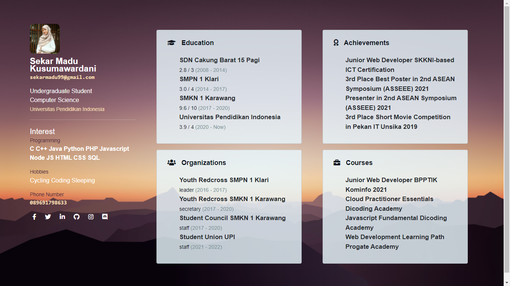

# CV Website
```
Created : May 4th 2021
```
> This repository was created as an exercise in using XML files to display data on web pages using the PHP language.

### Preview


### Tech
* [PHP](https://www.php.net/) - Hypertext Preprocessor, is the most popular server-side-scripting programming language especially for web development
* [XML](https://www.w3.org/XML/) - Extensible Markup Language (XML) is a simple, very flexible text format derived from SGML (ISO 8879).

### Tools
* [XAMPP](https://apachefriends.org/) - an easy to install Apache distribution containing MariaDB, PHP, and Perl.
* [Visual Studio Code](https://code.visualstudio.com/) - a code editor redefined and optimized for building and debugging modern web and cloud applications.
* [Google Chrome](https:/google.com/) - a cross-platform web browser developed by Google.

### Requirements
* XAMPP 7.4.9 or later version

### Running & Installation
1. Save all files into *C:\xampp\htdocs\[your folder]*
2. Start Apache from XAMPP Control Panel
3. Open a browser and access the file by typing *localhost/[your folder]* in the URL
4. You will automatically access the index file or main page of this system's web

### Credits
[Sekar Madu Kusumawardani](https://instagram.com/sekarmk03/)